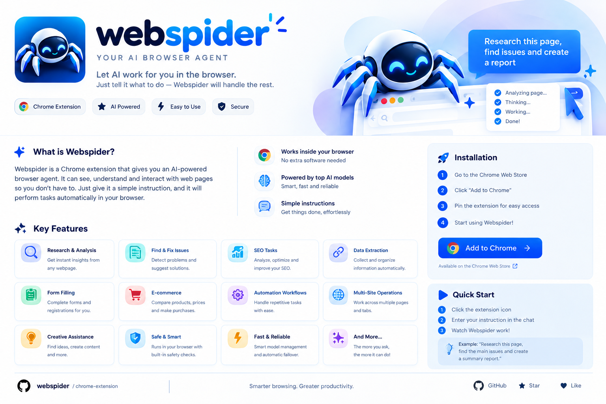

<div align="center">


# WebSpider

**Let AI work for you in the browser. Just tell it what to do — WebSpider handles the rest.**

WebSpider is a Chrome side-panel agent that drives your **real** browser: it reads the
page, understands the controls, clicks, types, extracts, audits, verifies its own work and
recovers when a model fails. No separate software, no cloud dashboard — one extension,
your own API key.

[](#)
[](LICENSE)
[](#install)
[](#requirements)
[](#tools-the-agent-can-use)
[](#verification)
[](https://github.com/rkfcode/ChromeAgent-WebSpider/stargazers)

**English** · [فارسی](README.fa.md)

</div>



---

## Table of contents

- [Why WebSpider](#why-webspider)
- [Features](#features)
- [Install](#install)
- [Quick start](#quick-start)
- [Connect a model](#connect-a-model)
- [Tools the agent can use](#tools-the-agent-can-use)
- [Modes](#modes)
- [Speed and accuracy](#speed-and-accuracy)
- [Human verification and CAPTCHA](#human-verification-and-captcha)
- [Privacy](#privacy)
- [Keyboard](#keyboard)
- [Requirements](#requirements)
- [Architecture](#architecture)
- [Verification](#verification)
- [Troubleshooting](#troubleshooting)
- [Contributing](#contributing)
- [License](#license)
- [Creator and support](#creator-and-support)

---

## Why WebSpider

Most "AI browser" tools are a chat box bolted onto a page. They cannot see the controls,
they guess CSS selectors, and when a click silently does nothing they happily report
success. WebSpider was built around the opposite assumption: **an agent that cannot prove
what it did is not an agent.**

So every control gets a stable `elementId`, every mutating action is followed by a real
page-state read, and the result tells you whether the page actually changed. When it did
not, WebSpider says so instead of counting it as a win.

## Features

| | |
| --- | --- |
| 🧰 **45 built-in tools** | Read, act, wait, audit and safety tools — see [the catalogue](#tools-the-agent-can-use) or **Settings → Tools** in the panel. |
| ✅ **Verifies its own actions** | Every mutating action is followed by a cheap page-state read; the answer includes whether the page actually changed. |
| 🧠 **Three modes** | Agent (acts), Plan (plans first and **cannot** mutate the page), Research (read-only evidence). |
| 🔎 **Deterministic audits** | SEO, accessibility (real WCAG contrast maths), performance, links and content — each scored 0–100 with a severity-ranked issue list. |
| ⚡ **Fast by default** | Read-only tool calls run concurrently, snapshots are cached, and three speed profiles trade thoroughness for round trips. |
| 🛡️ **Human-verification aware** | Detects a CAPTCHA, pauses, shows you the screen, and **resumes from the same step the moment you solve it**. It never solves or bypasses one. |
| 🔁 **Model failover** | A timeout on one model automatically tries the next known-good one. Auth errors never trigger failover. |
| 🌊 **Live streaming** | Token-by-token answers, with an automatic non-streaming retry when a provider rejects `stream:true`. |
| ✋ **Confirmation gate** | Purchases, deletion, sending, submission and other sensitive actions pause for your approval first. |
| 🖱️ **Stable element targeting** | Location falls back through `elementId` → selector → role → text → index, folding case, punctuation, curly quotes and diacritics. |
| 🪟 **Cross-frame aware** | Works in iframes and shadow DOM, and re-targets itself when a click opens a popup, OAuth window or new tab. |
| 🗂️ **Console & dialog capture** | Reads the page's **own** `console.*` output and native `alert`/`confirm`/`prompt` calls via a MAIN-world bridge. |
| 💬 **Full interface** | Dark/light/system theme, four accents, three text sizes, Markdown answers with copy buttons, chat history, JSON export, toasts, real modals, keyboard shortcuts, RTL and reduced-motion support. |

## Install

1. Open `chrome://extensions` and turn on **Developer mode**.
2. Click **Load unpacked** and select this folder.
3. Pin **WebSpider** to the toolbar, then click it (or press `Alt+Shift+W`) to open the side panel.
4. Open **Settings → Connection**, enter an OpenAI-compatible base URL and API key, then
   press **Save & test**.

There is nothing to build and no dependencies to install — the extension is plain
HTML, CSS and JavaScript.

## Quick start

1. Open any page you want to work with.
2. In the panel, type what you want in plain language — for example
   *"Research this page, find the main issues and write a short summary."*
3. Press **Send**. Watch the steps stream in as WebSpider inspects, acts and verifies.
4. Approve any confirmation prompt, and complete any CAPTCHA yourself — the run resumes
   automatically the moment you are done.

## Connect a model

WebSpider speaks the OpenAI **Chat Completions** protocol, so anything compatible works.

| | |
| --- | --- |
| **Base URL** | e.g. `https://api.openai.com/v1` — WebSpider resolves `/chat/completions` and `/models` from it. |
| **API key** | Stored only in `chrome.storage.local` on your machine. Never logged, never shown in an error. |
| **Works with** | OpenAI, Azure OpenAI, OpenRouter, Groq, DeepSeek, Together, Mistral, Ollama, LM Studio, vLLM, and any other OpenAI-compatible gateway. |

Press **Save & test** and WebSpider lists the available models and health-checks them,
reporting latency. If `/models` is unavailable, pin a model id manually in the same tab.
Your API key is sent **only** to the endpoint you configured.

## Tools the agent can use

**Read & inspect**

| Tool | What it returns |
| --- | --- |
| `page_snapshot` | Structured page overview with stable `elementId`s for controls |
| `page_state` | Cheap state read plus a content hash, for "did anything change?" |
| `page_diagnostics` | Page errors, console errors, broken images, slow resources, suspicious links |
| `query_elements` | Structured list for any CSS selector (role, name, text, rect, visibility) |
| `get_table` | Headers, rows, or objects keyed by header |
| `get_form` | Fields with labels, values, required flags, options and validation state |
| `find_in_page` | Text matches with surrounding context, and the elements containing them |
| `get_selection` | The text the user has selected |
| `console_logs` | Console messages captured in the page's own JavaScript world |
| `dialog_log` | Native `alert` / `confirm` / `prompt` calls the page raised |
| `network_log` | Resource timings, transfer sizes, cache status |
| `styles_of` | Computed styles, effective background, WCAG contrast ratio |
| `audit` | `seo` · `a11y` · `perf` · `links` · `content` · `all`, scored and ranked |
| `extract` | Readable text, HTML, links or a table from an area |
| `mark_page` / `diff_page` | Prove exactly what changed |

**Act on the page** — `navigate` · `open_tab` · `back` · `forward` · `click` · `click_at` ·
`type` · `clear_field` · `select` · `check` · `hover` · `focus` · `press_key` ·
`submit_form` · `scroll` · `scroll_to` · `highlight` · `draw` · `screenshot`

**Wait & verify** — `wait` · `wait_for_element` · `wait_for_text` · `wait_for_dom_stable` ·
`wait_for_network_idle`

**Safety & control** — `detect_human_check` · `human_verification` · `ask_confirmation` ·
`set_dialog_policy` · `sync_browser_target`

Snapshots label every control with a stable `elementId`; the agent targets those first,
which is far more reliable than guessing CSS selectors.

## Modes

| Mode | What it does |
| --- | --- |
| **Agent** | Full capability — reads the page and acts on it. |
| **Plan** | Investigates and returns a step-by-step plan. First-turn tool calls are discarded, so a plan can never change the page. |
| **Research** | Read-only evidence gathering. Acts are refused; the agent reads, extracts and audits only. |

## Speed and accuracy

| Setting | Default | Effect |
| --- | --- | --- |
| Execution speed | Balanced | `Fast` skips post-action verification and caches longer; `Thorough` never caches and re-reads after every action |
| Verify the page after each action | On | Attaches an `after` block to every mutating action |
| Reuse a recent page snapshot | On | Saves a round trip when the agent inspects repeatedly |
| Pause for CAPTCHA, resume automatically | On | Never solves a challenge; pauses and resumes |

Read-only tool calls issued in the same turn run **concurrently**. Any mutating call is a
barrier, so the order the model asked for is the order the page sees.

## Human verification and CAPTCHA

WebSpider **detects** human-verification challenges — reCAPTCHA, hCaptcha, Cloudflare
Turnstile, Arkose, GeeTest, DataDome, PerimeterX, AWS WAF and MTCaptcha — names the vendor,
pauses the run and shows you the screen. It then polls the page and **resumes from the same
step the instant you have solved it**.

It will never solve, click, interpret or bypass a challenge. That is a deliberate design
decision, not a missing feature: a CAPTCHA is a security control, and automating it enables
mass account creation and abuse.

## Privacy

> What happens on your screen stays on your machine.

- **No telemetry, no analytics, no accounts, no auto-update pings.**
- **Page content is read locally.** The only bytes that leave your computer are the ones
  the model needs to answer your request, sent **only** to the endpoint you configured.
- **Your API key** lives in `chrome.storage.local` and is never logged or echoed.
- **Your conversations** are stored locally as `chatSessions` and are yours to export or
  delete from the History drawer.

## Keyboard

| Shortcut | Action |
| --- | --- |
| `Enter` | Send (configurable in Settings → Agent) |
| `Shift+Enter` | New line |
| `Ctrl/Cmd+K` | Focus the composer |
| `Alt+1 / 2 / 3` | Agent / Plan / Research |
| `Esc` | Close the modal or drawer |
| `Alt+Shift+W` | Open the WebSpider side panel |

## Requirements

**To run:** Chrome 114 or newer (Manifest V3, side panel API). Nothing else — no build
step, no dependencies, no background service.

**To develop:** any text editor. To run the test suite you need Node 22+ and `jsdom`.

## Architecture

| File | Role |
| --- | --- |
| `manifest.json` | MV3 manifest: side panel, service worker, content script, MAIN-world bridge |
| `main.js` | MAIN-world bridge (`document_start`): console + native dialog capture |
| `sidepanel.html` | Panel markup and the SVG icon sprite |
| `style.css` | Design tokens, both themes, logical-property layout |
| `sidepanel.js` | UI state machine, rendering, i18n, tool catalogue, persistence, export |
| `background.js` | Agent loop, SSE streaming, model failover, tool dispatch, verification |
| `content.js` | Page agent: locate, snapshot, readers, audits, actions, waits, overlays |

Conversations are stored in `chrome.storage.local` as `chatSessions`; the live agent state
is `agentState`. Storage keys are part of the data contract — renaming one loses history.

`content.js` runs in the isolated world and cannot see the page's JavaScript. `main.js` runs
in the page's own world and passes what it captures back through DOM slots
(`#__webspider_console`, `#__webspider_dialogs`) — the two worlds share the DOM, not the
JavaScript heap.

## Verification

```
NODE_PATH=<node-workspace>/node_modules node .workbuddy-ai/tools/run-suite.mjs
```

Four stages, all run in-process:

| Stage | What it proves |
| --- | --- |
| `check-syntax.mjs` | Every file parses; icons, i18n keys and DOM selectors resolve; tool wiring is complete; the manifest is valid |
| `test-core.mjs` | Endpoint parsing, message-trim invariants, SSE assembly, streaming fallback, tool schemas, speed profiles, the human-check watchdog, and a whole run driven end-to-end against a stubbed model |
| `test-panel.mjs` | The real panel in jsdom: boot, quick actions, modes, i18n, theme, streaming, persistence, delete flows, keyboard, the tool catalogue, execution settings, export |
| `test-content.mjs` | The real content script in jsdom: snapshot ids, actions, waits, readers, audits, human-check detection, dispatch hardening |

**661 assertions plus 12 static checks, all green.** The static stage carries four
cross-file guards: worker dispatch ↔ content-script handler, declared tool ↔ `act()`
branch, declared tool ↔ panel catalogue, and the MAIN-world manifest registration.

Every guard in the suite was validated by injecting the bug it exists to catch — a guard
that stays green under its own bug is decoration, not a test.

## Troubleshooting

| Symptom | Fix |
| --- | --- |
| "API Key is missing" | Open **Settings → Connection**, paste a key and press **Save & test**. |
| "All verified models and endpoints failed" | Check the base URL, the key and your network. The panel shows the last error per model. |
| The agent reports the page "did NOT change" | The click landed on nothing. Ask it to take a snapshot or run `page_diagnostics`. |
| A run pauses and shows a challenge | That is the CAPTCHA gate. Solve it in the page — the run resumes by itself. |
| The side panel does not open | Pin the extension and click its icon, or press `Alt+Shift+W`. |

## Contributing

Issues and pull requests are welcome — see [CONTRIBUTING.md](CONTRIBUTING.md) for the
workflow and house rules. To report a vulnerability privately, follow
[SECURITY.md](SECURITY.md).

## License

[MIT](LICENSE).

## Creator and support

Built by **Reza Kazemi Fathi**.

<div align="center">

[](https://github.com/rezakazemifathi)
[](https://instagram.com/rkfcode)
[](https://youtube.com/rkfcode)

</div>

If WebSpider saved you some clicking, a ⭐ on the repository genuinely helps.

Support the project: [Daramet (IRR)](https://daramet.com/RKFi) ·
[Donatr.ee (USD / crypto)](https://donatr.ee/rkfcode/)
